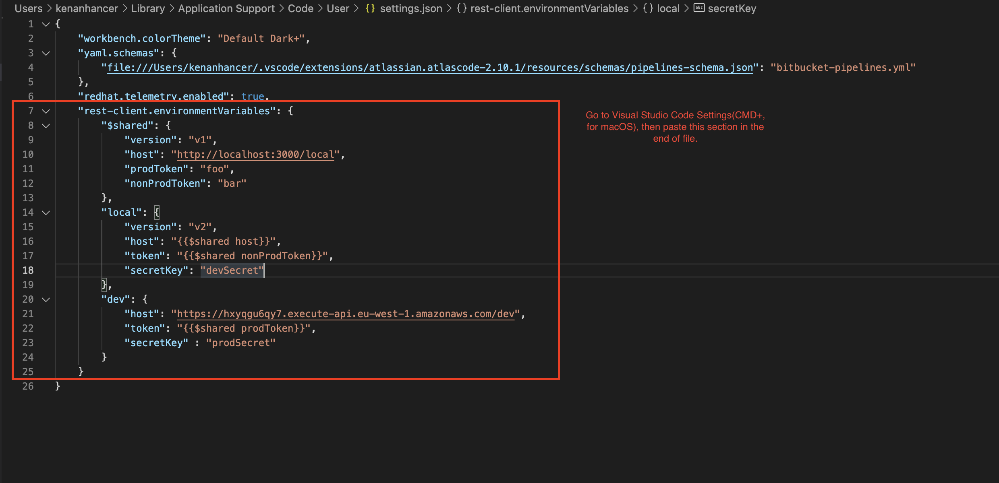

# How to set up REST Client extension in Visual Studio Code

this is a sample setting so you can add more environment like `production` or more fields in environments. Copy and paste below json to your visual studio code settings file (`CMD+,` for macOS)

```json
"rest-client.environmentVariables": {
    "$shared": {
        "version": "v1",
        "host": "http://localhost:3000/local",
        "prodToken": "foo",
        "nonProdToken": "bar"
    },
    "local": {
        "version": "v2",
        "host": "{{$shared host}}",
        "token": "{{$shared nonProdToken}}",
        "secretKey": "devSecret"
    },
    "dev": {
        "host": "https://hxyqgu6qy7.execute-api.eu-west-1.amazonaws.com/dev",
        "token": "{{$shared prodToken}}",
        "secretKey" : "prodSecret"
    }
}
```


